# CloudFerro components runbook
### Document change control

 Version | Date | Pages | Processor | Changes| 
 --------|------|-------|-----------|---------
1B | 14.11.2019 | N/A | Markdown  |  Tenant creation in Morpheus - runbook 2  |

### Morpheus

##### 1. General awareness of the Morpheus structure in the context of its functionality
   - basic management of various modules
      - Operations
      - Provisioning
      - Infrastructure
      - Administration


##### 2.  Tenant provisioning (Master tenant level)

   - Adjusting permissions by assigning a proper role
   - Adding users with different permissions
   - Verifying quota and t-shirt size restrictions


##### 3.  User provisioning
  - User creation in a Tenant area
      - optionally checking in "password expired" mode
      - Adjusting role to the particular user
      - optionally providing basic cloud-init settings
   
   
##### 4.  Cloud configuration
  - Verifying a correct DPI instance by a survey result
    - Enabling Instance discovering and and assigning OpenStack Identity


##### 5. Post-provisioning operations on the Support side
   - Checking if the user has been provisioned properly
      - verifying a correctness signing on
      - verifying access to the cloud resources
      - verifying access to the object storage
      - verifying role adjustment
      - verifying general permissions


##### 6. Morpheus operations - "be ready to aid"
   - Provisioning instances
   - Uploading images
   - Configuring networks
   - Applying blueprints and workflows
   - Volume management
   - Object storage configurations
   - Group management


##### 7. Morpheus troubleshooting
  - Impersonating a specific use
  - IT Administration escalation - consider restarting the service

### Openstack

##### 1. Support awareness based on DeltaDesign concept
   - Clouds locations
   - Clouds user-specific use-cases
   - User destinations
   - Data available only to particular cloud instance


##### 2.  Project provisioning (OpenStack admin account)
   - Creating a project in default domain
   - Verifying quota size for particular projects


##### 3.  User provisioning
  - User creation in a domain-project area
      - configuring User passwords related to the Morpheus accounts
      - Adjusting role to the particular user 


##### 4. Post-provisioning operations on the Support side
   - Checking if the user has been provisioned properly
      - verifying a correctness signing on
      - verifying access to the cloud resources
      - verifying access to the object storage
      - verifying role adjustment
      - verifying general permissions


##### 5. OpenStack troubleshooting
  - Impersonating a specific user
  - Re-production of the issues in separated development environment
  - Fixing discrepancies between Morpheus and OpenStack configuration panels
  - IT Administration escalation


# Morpheus runbook 1

### User creation - three methods explained

#### 1. GUI

There have been used **impersonating** option in order to perform all operations in the tenant context.
Open your morpheus dashboard and navigate to the Administration tab on the right corner.
<kbd>
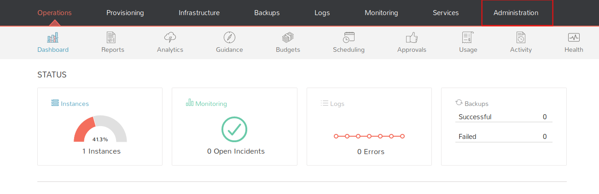
</kbd>

Choose option called **Users**.
<kbd>
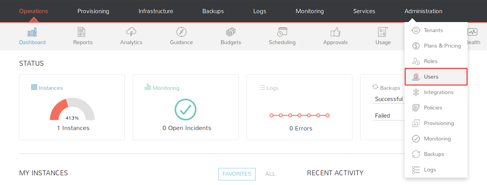
</kbd>

Click on the blue button **+ CREATE USER**.
<kbd>
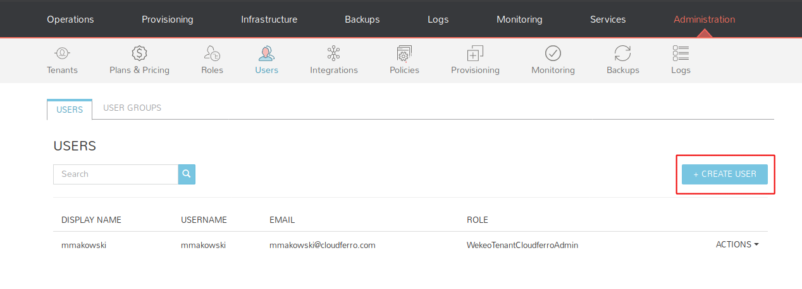
</kbd>

Take a look at the form to supply. In most cases you do not need to fill in every blank. Red color surrounded parameters are required in WEKEO use cases.
<kbd>
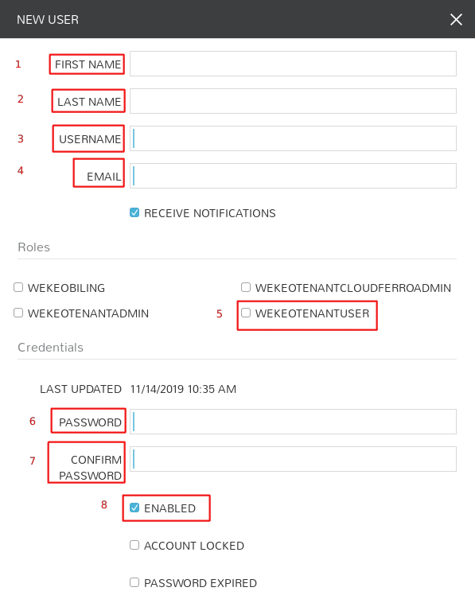
</kbd>

You can also configure additional parameters for distinct logging on Linux instances and Windows instances as well.
<kbd>
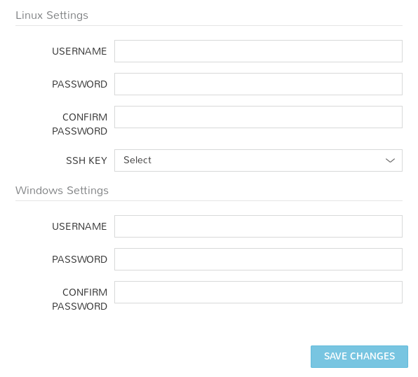
</kbd>

Below an example of filled in form. You can apply this configuration by clicking on **save changes**.
<kbd>
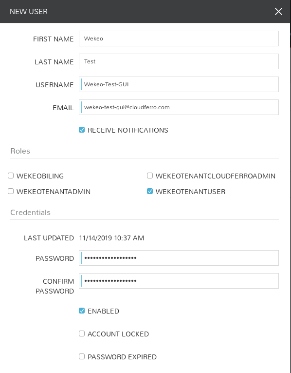
</kbd>

The new user has been added to your Tenant.
<kbd>

</kbd>

#### 2. API
You can use various programming languages and CURL also.
In this demonstration you can take a look at the code created in Ruby 2.6.5 using net/http module.


``` ruby
require 'net/http'
require 'uri'
require 'json'

=begin
Remember to export environment variables!
export MORPHEUS_API_URL="https://morpheus.wekeo-dev.cloudferro.com"
export MORPHEUS_API_TOKEN=$(morpheus access-token) gem morpheus-cli required
=end

#Morpheus Appliance URL combined with desired API method. 
#Attention ! /accounts/15/users points on the tenant with ID 15. You have to reassure yourself if you have chosen a correct ID.
url=URI.parse("#{ENV['MORPHEUS_API_URL']}/api/accounts/15/users")

#Headers for POST query
headers = {'Content-Type' => 'text/json',
           'Authorization' => "BEARER #{ENV['MORPHEUS_API_TOKEN']}"}

#Creating http object/requring ssl connection
http = Net::HTTP.new(url.host,url.port)
http.use_ssl=true

#Json data structure
data = {user:
    {
    username: "Wekeo-Test-API",
    email: "wekeo-test-api@cloudferro.com",
    firstName: "Wekeo",
    lastName: "Test",
    password: "aStrongpassword123!",
    role: {"id": 98}
    #id 98 points on our standard WekeoTenantUser
  }
}

#Creating post object
request = Net::HTTP::Post.new(url.request_uri, headers)

#Equipping our request in json data
request.body=data.to_json

#Sending http post request
response = http.request(request)

#Obtaining a response
puts response.body
```

Confirmation in Morpheus dashboard:
<kbd>
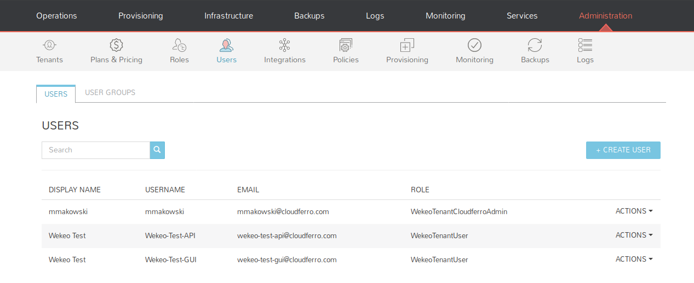
</kbd>

#### 3. CLI

You can take a look at --help flag for more advanced parameters.
``` bash
User@WEKEO:~/morpheus$ morpheus users add --firstName "Wekeo" --lastName "Test" --username "Wekeo-Test-CLI" \
--email "wekeo-test-cli@cloudferro.com" --password "Strongpass123!" --role "WekeoTenantUser" --account-id 15
Confirm Password: 
Max Storage (bytes) (optional): 
Max Memory (bytes) (optional): 
CPU Count (optional): 
Added user Wekeo-Test-CLI to account CF_mmakowski

User Details
==================

      ID: 58
 Account: CF_mmakowski
    Name: Wekeo Test
Username: Wekeo-Test-CLI
   Email: wekeo-test-cli@cloudferro.com
    Role: WekeoTenantUser
 Created: 11/14/19 10:10 AM
 Updated: 11/14/19 10:10 AM
```

# Morpheus runbook 2

### Tenant creation - three methods explained

#### 1. GUI

Sign in with your account in **master tenant**. Open your morpheus dashboard and navigate to the Administration tab on the right corner.
<kbd>
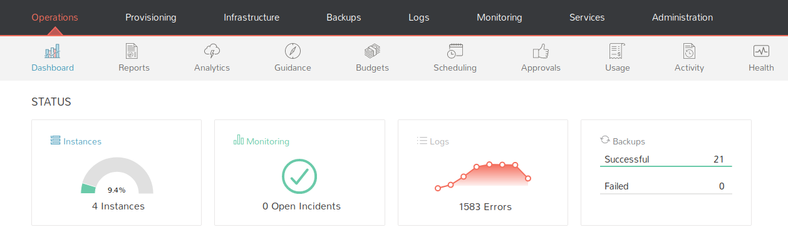</kbd>

Choose option called **Tenants**.
<kbd>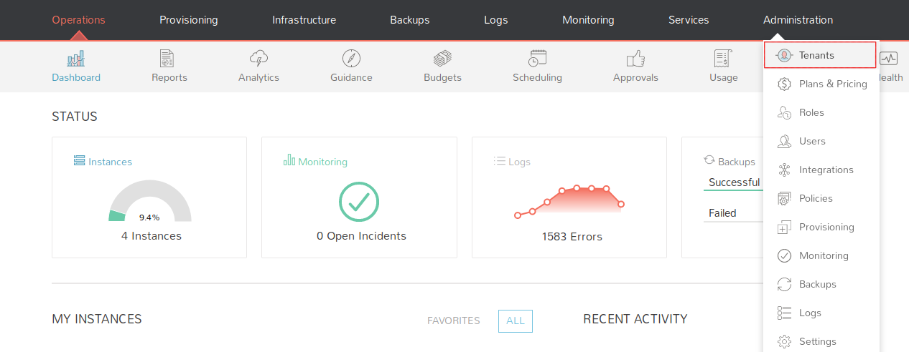.</kbd>

Click on the blue button **+CREATE TENANT**.
<kbd>
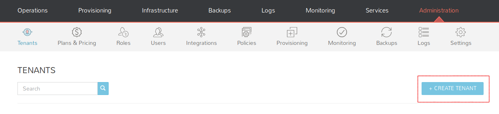
</kbd>

Take a look at the form to supply. The most importants parameters are: Name, Subdomain and Role. |  Below you can examine a basic configuration.Set up a basic role for
:-------------------------:|:-------------------------:
<kbd>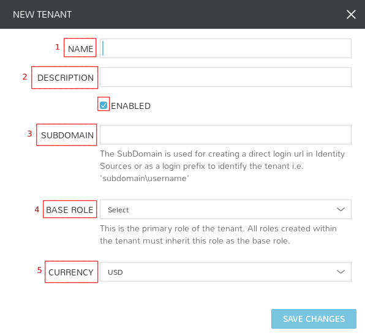</kbd>  |  <kbd>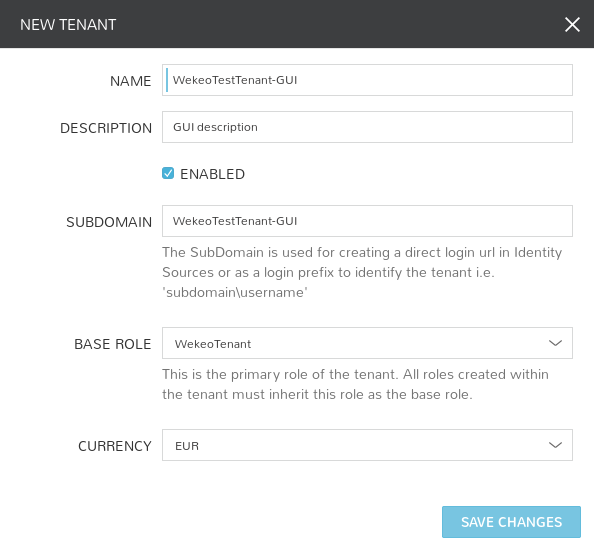</kbd>


Click on save changes and check if your tenant has been created properly.

<kbd>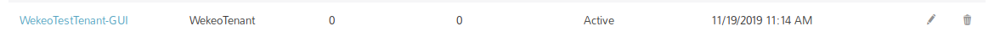.</kbd>

If you click on **WekeoTestTenant-GUI** you will be redirected to the specific Tenant panel where you are able to create users.

<kbd>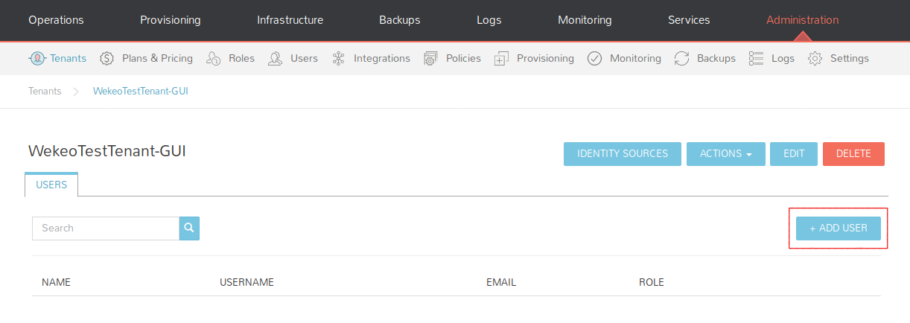.</kbd>

#### 2. API

You can use various programming languages and CURL also.
In this demonstration you can take a look at the code created in Ruby 2.6.5 using net/http module.

```ruby
require 'net/http'
require 'uri'
require 'json'

=begin
Remember to export environment variables!
export MORPHEUS_API_URL="https://morpheus.wekeo-dev.cloudferro.com"
export MORPHEUS_API_TOKEN=$(morpheus access-token)
=end

#Morpheus Appliance URL combined with desired API method
url = URI.parse("#{ENV['MORPHEUS_API_URL']}/api/accounts")

#Headers for POST query
headers = {'Content-Type' => 'text/json',
           'Authorization' => "BEARER #{ENV['MORPHEUS_API_TOKEN']}"}

#Creating http object/requring ssl connection
http = Net::HTTP.new(url.host,url.port)
http.use_ssl = true

#Json data structure
data = {account:
    {
    name: "WekeoTestTenant-API",
    description: "My description",
    subdomain: "WekeoTestTenant-API",
    role: {"id": 24}
    #id 98 points on our standard WekeoTenant role
  }
}

#Creating post object
request = Net::HTTP::Post.new(url.request_uri, headers)

#Equipping our request in json data
request.body=data.to_json

#Sending http post request
response = http.request(request)

#Obtaining a response
puts response.body

```

#### 3. CLI

Adding WekeoTestTenant-CLI tenant:
``` bash
User@WEKEO:~/morpheus$ morpheus tenants add --name "WekeoTestTenant-CLI" --description "Test" --role "WekeoTenant" --currency "EUR"

Tenant WekeoTestTenant-CLI added

Tenant Details
==================

         ID: 44
       Name: WekeoTestTenant-CLI
Description: Test
  Subdomain: 
   Currency: EUR
    Created: 11/22/19 09:58 AM
    Updated: 11/22/19 09:58 AM
     Status: ACTIVE
```
Setting up a subdomain:
``` bash
User@WEKEO:~/morpheus$ morpheus tenants update {id} -O subdomain="subdomain_name"
```
Setting up a subdomain:for WekeoTestTenant-CLI:
```
User@WEKEO:~/morpheus$ morpheus tenants update 44 -O subdomain="WekeoTestTenant-CLI"

Tenant WekeoTestTenant-CLI updated

Tenant Details
==================

         ID: 44
       Name: WekeoTestTenant-CLI
Description: Test
  Subdomain: WekeoTestTenant-CLI
   Currency: EUR
    Created: 11/22/19 09:58 AM
    Updated: 11/22/19 09:59 AM
     Status: ACTIVE
```


