# CloudFerro components runbook
### Document change control

 Version | Date | Pages | Processor | Changes| 
 --------|------|-------|-----------|---------
1D | 09.12.2019 | N/A | Markdown  |  Post-provisioning operations on the Support side in Morpheus - runbook 4 <br> Project provisioning in OpenStack - runbook 3


### [Morpheus](#morpheus-runbook-1)

##### 1. General awareness of the Morpheus structure in the context of its functionality
   - basic management of various modules
      - Operations
      - Provisioning
      - Infrastructure
      - Administration


##### 2.  [Tenant provisioning (Master tenant level)](#tenant-creation-three-methods-explained)

   - Adjusting permissions by assigning a proper role
   - Adding users with different permissions
   - Verifying quota and t-shirt size restrictions


##### 3.  [User provisioning](#user-creation-three-methods-explained) 
  - User creation in a Tenant area
      - optionally checking in "password expired" mode
      - Adjusting role to the particular user
      - optionally providing basic cloud-init settings
   
   
##### 4.  [Cloud configuration](#cloud-configuration)
  - Verifying a correct DPI instance by a survey result
    - Enabling Instance discovering and and assigning OpenStack Identity


##### 5. [Post-provisioning operations on the Support side](#post-provisioning-operations-on-the-support-side-in-morpheus)
   - Checking if the user has been provisioned properly
      - verifying a correctness signing on
      - verifying access to the cloud resources
      - verifying access to the object storage
      - verifying role adjustment
      - verifying general permissions


##### 6. Morpheus operations - "be ready to aid"
   - Provisioning instances
   - Uploading images
   - Configuring networks
   - Applying blueprints and workflows
   - Volume management
   - Object storage configurations
   - Group management


##### 7. Morpheus troubleshooting
  - Impersonating a specific use
  - IT Administration escalation - consider restarting the service

### [Openstack](#openstack-runbook-1)

##### 1. Support awareness based on DeltaDesign concept
   - Clouds locations
   - Clouds user-specific use-cases
   - User destinations
   - Data available only to particular cloud instance


##### 2.  [Project provisioning (OpenStack admin account)](#project-provisioning)
   - Creating a project in default domain
   - Verifying quota size for particular projects


##### 3.  [User provisioning](#user-provisioning)
  - User creation in a domain-project area
      - configuring User passwords related to the Morpheus accounts
      - Adjusting role to the particular user 


##### 4.  [Post-provisioning operations on the Support side](#post-provisioning-operations-on-the-support-side-in-openstack)
   - Checking if the user has been provisioned properly
      - verifying access to the cloud resources
      - verifying access to the object storage
      - verifying role adjustment


##### 5. OpenStack troubleshooting
  - Impersonating a specific user
  - Re-production of the issues in separated development environment
  - Fixing discrepancies between Morpheus and OpenStack configuration panels
  - IT Administration escalation


# Morpheus runbook 1

### User creation - three methods explained

#### 1. GUI

There have been used **impersonating** option in order to perform all operations in the tenant context.
Open your morpheus dashboard and navigate to the Administration tab on the right corner.
<kbd>

</kbd>

Choose option called **Users**.
<kbd>

</kbd>

Click on the blue button **+ CREATE USER**.
<kbd>

</kbd>

Take a look at the form to supply. In most cases you do not need to fill in every blank. Red color surrounded parameters are required in WEKEO use cases.
<kbd>

</kbd>

You can also configure additional parameters for distinct logging on Linux instances and Windows instances as well.
<kbd>

</kbd>

Below an example of filled in form. You can apply this configuration by clicking on **save changes**.
<kbd>

</kbd>

The new user has been added to your Tenant.
<kbd>

</kbd>

#### 2. API
You can use various programming languages and CURL also.
In this demonstration you can take a look at the code created in Ruby 2.6.5 using net/http module.


``` ruby
require 'net/http'
require 'uri'
require 'json'

=begin
Remember to export environment variables!
export MORPHEUS_API_URL="https://morpheus.wekeo-dev.cloudferro.com"
export MORPHEUS_API_TOKEN=$(morpheus access-token) gem morpheus-cli required
=end

#Morpheus Appliance URL combined with desired API method. 
#Attention ! /accounts/15/users points on the tenant with ID 15. You have to reassure yourself if you have chosen a correct ID.
url=URI.parse("#{ENV['MORPHEUS_API_URL']}/api/accounts/15/users")

#Headers for POST query
headers = {'Content-Type' => 'text/json',
           'Authorization' => "BEARER #{ENV['MORPHEUS_API_TOKEN']}"}

#Creating http object/requring ssl connection
http = Net::HTTP.new(url.host,url.port)
http.use_ssl=true

#Json data structure
data = {user:
    {
    username: "Wekeo-Test-API",
    email: "wekeo-test-api@cloudferro.com",
    firstName: "Wekeo",
    lastName: "Test",
    password: "aStrongpassword123!",
    role: {"id": 98}
    #id 98 points on our standard WekeoTenantUser
  }
}

#Creating post object
request = Net::HTTP::Post.new(url.request_uri, headers)

#Equipping our request in json data
request.body=data.to_json

#Sending http post request
response = http.request(request)

#Obtaining a response
puts response.body
```

Confirmation in Morpheus dashboard:
<kbd>

</kbd>

#### 3. CLI

You can take a look at --help flag for more advanced parameters.
``` bash
User@WEKEO:~/morpheus$ morpheus users add --firstName "Wekeo" --lastName "Test" --username "Wekeo-Test-CLI" \
--email "wekeo-test-cli@cloudferro.com" --password "Strongpass123!" --role "WekeoTenantUser" --account-id 15
Confirm Password: 
Max Storage (bytes) (optional): 
Max Memory (bytes) (optional): 
CPU Count (optional): 
Added user Wekeo-Test-CLI to account CF_mmakowski

User Details
==================

      ID: 58
 Account: CF_mmakowski
    Name: Wekeo Test
Username: Wekeo-Test-CLI
   Email: wekeo-test-cli@cloudferro.com
    Role: WekeoTenantUser
 Created: 11/14/19 10:10 AM
 Updated: 11/14/19 10:10 AM
```

# Morpheus runbook 2

### Tenant creation - three methods explained

#### 1. GUI

Sign in with your account in **master tenant**. Open your morpheus dashboard and navigate to the Administration tab on the right corner.
<kbd>
</kbd>

Choose option called **Tenants**.
<kbd>.</kbd>

Click on the blue button **+CREATE TENANT**.
<kbd>

</kbd>

Take a look at the form to supply. The most importants parameters are: Name, Subdomain and Role. |  Below you can examine a basic configuration.Set up a basic role for
:-------------------------:|:-------------------------:
<kbd></kbd>  |  <kbd></kbd>


Click on save changes and check if your tenant has been created properly.
<kbd>.</kbd>

If you click on **WekeoTestTenant-GUI** you will be redirected to the specific Tenant panel where you are able to create users.
<kbd>.</kbd>

#### 2. API

You can use various programming languages and CURL also.
In this demonstration you can take a look at the code created in Ruby 2.6.5 using net/http module.

```ruby
require 'net/http'
require 'uri'
require 'json'

=begin
Remember to export environment variables!
export MORPHEUS_API_URL="https://morpheus.wekeo-dev.cloudferro.com"
export MORPHEUS_API_TOKEN=$(morpheus access-token)
=end

#Morpheus Appliance URL combined with desired API method
url = URI.parse("#{ENV['MORPHEUS_API_URL']}/api/accounts")

#Headers for POST query
headers = {'Content-Type' => 'text/json',
           'Authorization' => "BEARER #{ENV['MORPHEUS_API_TOKEN']}"}

#Creating http object/requring ssl connection
http = Net::HTTP.new(url.host,url.port)
http.use_ssl = true

#Json data structure
data = {account:
    {
    name: "WekeoTestTenant-API",
    description: "My description",
    subdomain: "WekeoTestTenant-API",
    role: {"id": 24}
    #id 98 points on our standard WekeoTenant role
  }
}

#Creating post object
request = Net::HTTP::Post.new(url.request_uri, headers)

#Equipping our request in json data
request.body=data.to_json

#Sending http post request
response = http.request(request)

#Obtaining a response
puts response.body

```

#### 3. CLI

Adding WekeoTestTenant-CLI tenant:
``` bash
User@WEKEO:~/morpheus$ morpheus tenants add --name "WekeoTestTenant-CLI" --description "Test" --role "WekeoTenant" --currency "EUR"

Tenant WekeoTestTenant-CLI added

Tenant Details
==================

         ID: 44
       Name: WekeoTestTenant-CLI
Description: Test
  Subdomain: 
   Currency: EUR
    Created: 11/22/19 09:58 AM
    Updated: 11/22/19 09:58 AM
     Status: ACTIVE
```
Setting up a subdomain:
``` bash
User@WEKEO:~/morpheus$ morpheus tenants update {id} -O subdomain="subdomain_name"
```
Setting up a subdomain:for WekeoTestTenant-CLI:
```
User@WEKEO:~/morpheus$ morpheus tenants update 44 -O subdomain="WekeoTestTenant-CLI"

Tenant WekeoTestTenant-CLI updated

Tenant Details
==================

         ID: 44
       Name: WekeoTestTenant-CLI
Description: Test
  Subdomain: WekeoTestTenant-CLI
   Currency: EUR
    Created: 11/22/19 09:58 AM
    Updated: 11/22/19 09:59 AM
     Status: ACTIVE
```

# Morpheus runbook 3

### Cloud configuration

**1. GUI**

Sign in with your account in master tenant or impersonificate into TenantAdmin. Open your morpheus dashboard and navigate to the Infrastructure tab on the right corner.
<kbd>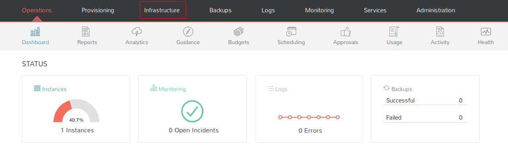
</kbd>

Click on the **Clouds.**
<kbd>
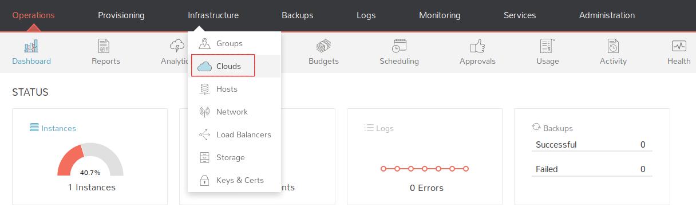
</kbd>

Click on the blue button **+ADD** on your right side.
<kbd>
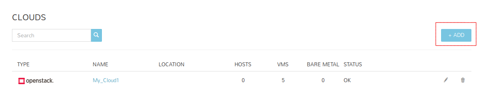
</kbd>

Search for openstack in search bar.  
<kbd>
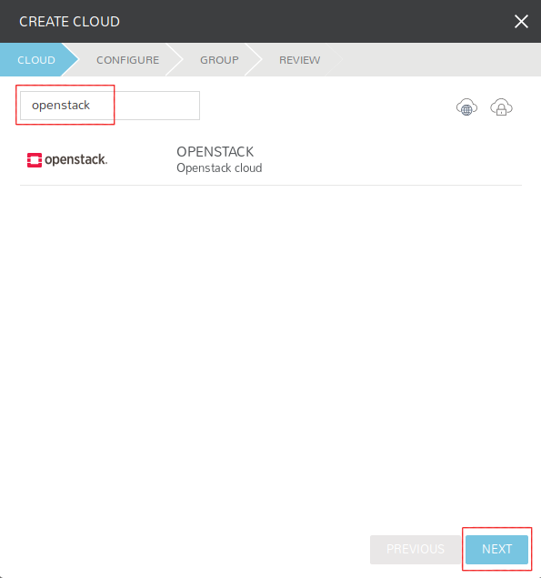
</kbd>

Take a look at the blank form.
* **IDENTITY API URL** points on the Keystone API endpoint.
* **Domain ID** points on the default.
* **Project, Username** and **Password** are related to the setup configured in OpenStack.


<kbd>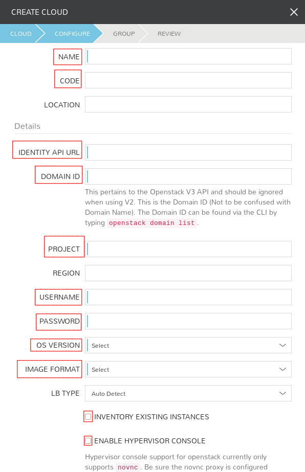
</kbd>

Example configuration for the cloud:  
<kbd>
</kbd>


Associate existing group with your cloud or optionally create a new one.  
<kbd>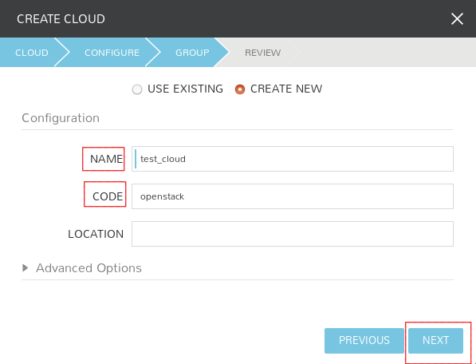
</kbd>

Newly created cloud configuration should start syncing. After that you should obtain an access to components such as security groups, networks etc. if they are currently present in the associated OpenStack project.
<kbd>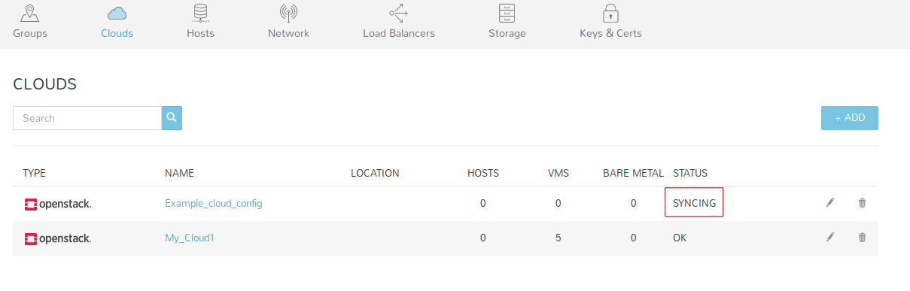
</kbd>

# Morpheus runbook 4

### Post-provisioning operations on the Support side in Morpheus

#### 1. GUI

Post-provisioning operations have been created in order to exclude potential issues related to the Tenant configuration.

##### Verify cloud configuration
Assure that your cloud configuration has been set up correctly.
<kbd>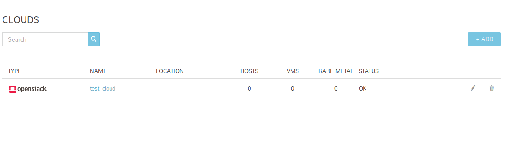
</kbd>  

Check if the synchronized components are visible:  
e.g networks
<kbd>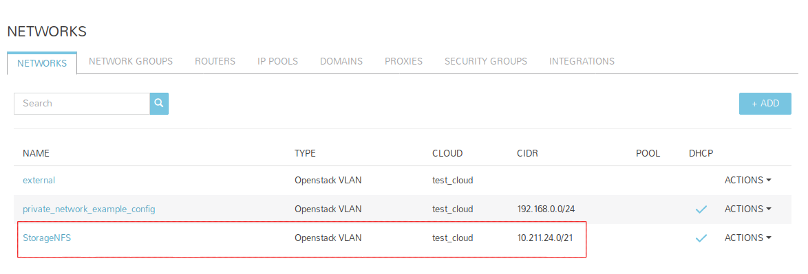
</kbd>  

e.g security groups
<kbd>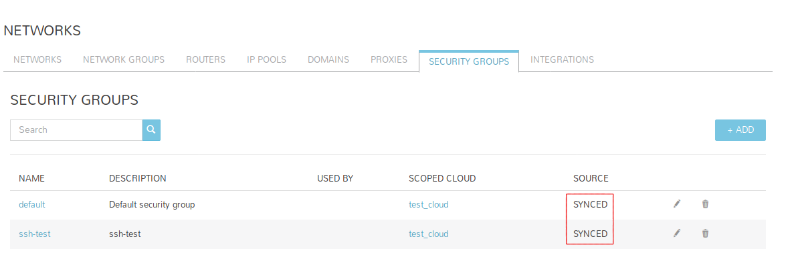
</kbd>

##### Verify Object Storage Access

After configuring S3 bucket, check whether you are able to upload/download files.
<kbd>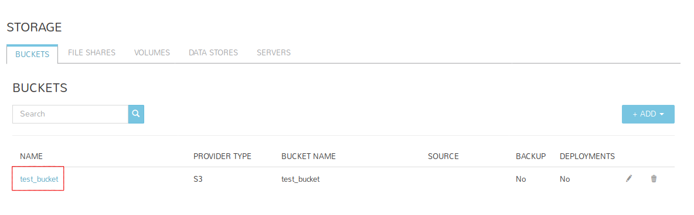
</kbd>  

e.g upload of the image.png file
<kbd>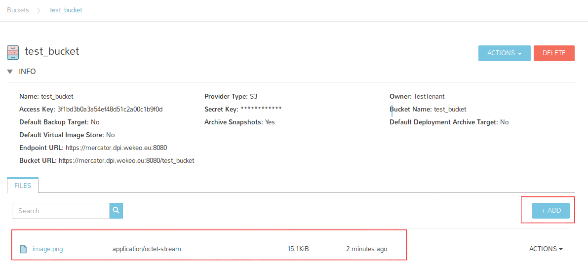
</kbd>  

You can verify visibility in OpenStack also.
<kbd>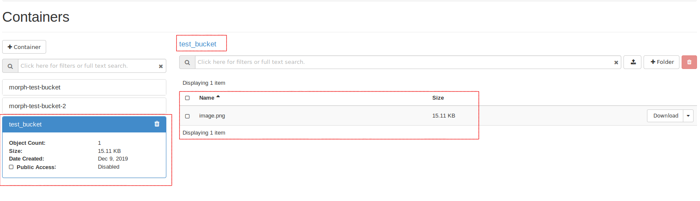
</kbd>

##### Verify role adjustment

Check out if the roles in Identity source are mapped correctly in integration between Morpheus and WSO2.
<kbd>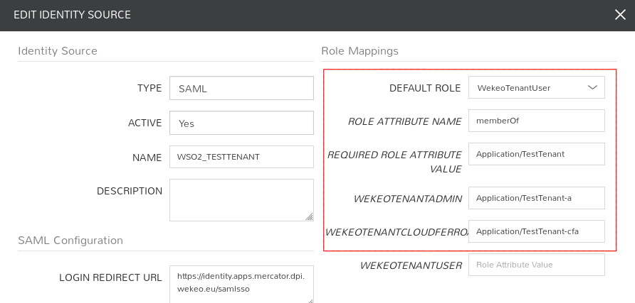
</kbd>  

Verify roles for specific users:
<kbd>
</kbd>

##### Verify signing on as a user

Copy login URL for a particular tenant and try to log in using user created in wso2.

Grab URL in the Identity source configuration:  
<kbd>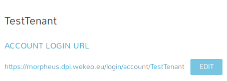
</kbd>

Paste URL into the browser address bar and choose WSO2 login option.  
<kbd>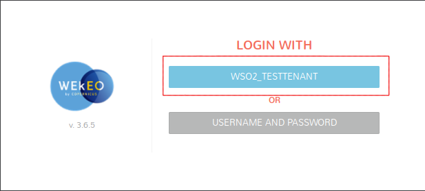
</kbd>

Admit the correctness for signing on.   
<kbd>
</kbd>


# OpenStack runbook 1

### Project provisioning

#### 1. GUI

If you want to create a new project from the OpenStack Horizon Dashboard level as admin go to Identity -> Projects.  
Make sure you are in the "admin" project.  
<kbd>

</kbd>

Press the "Create Project" button to create a new project.  
<kbd>
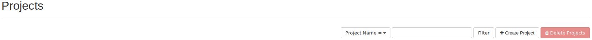
</kbd>

Add a name for the new project (e.g. new_project).  
<kbd>
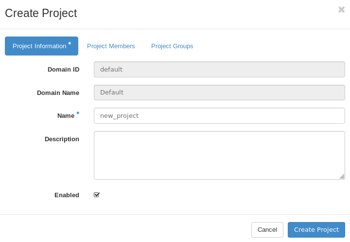
</kbd>

In the "Project Members" tab you can add users who will have access to the project.  
<kbd>
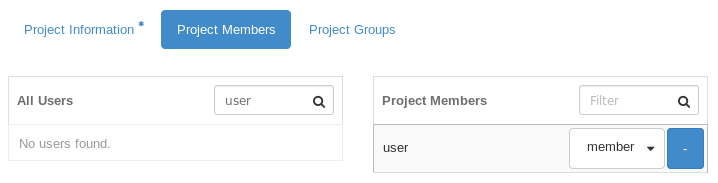
</kbd>  

To create a new project, press the "Create Project" button.
After correctly completing the project creation process, the new project will be visible in the menu.  
<kbd>
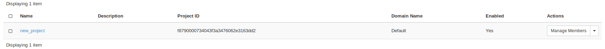
</kbd>  

You can move between different projects through the drop-down menu in the upper left corner of OpenStack Horizon Dashboard.  
<kbd>
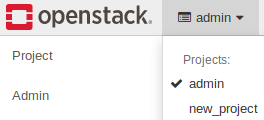
</kbd>

##### Verifying quota size

If you want to view project limit summary go to Project -> Compute -> Overview.  
The pie diagrams display limits for specific components.  
<kbd>
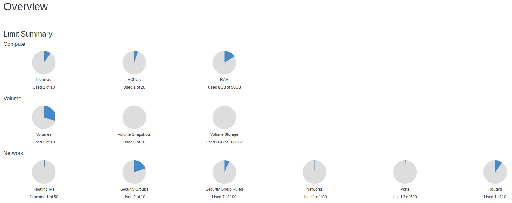
</kbd>

If you want to change quta size go to Identity -> Projects. Search for the project you are interested in and select the "Modify Quotas" option from the drop-down menu.  
Make sure you are in the "admin" project.  
<kbd>
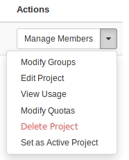
</kbd>

You can change the size of the quotas from the "Edit Quotas" window. Click on the "Save" button to save your changes.  
<kbd>
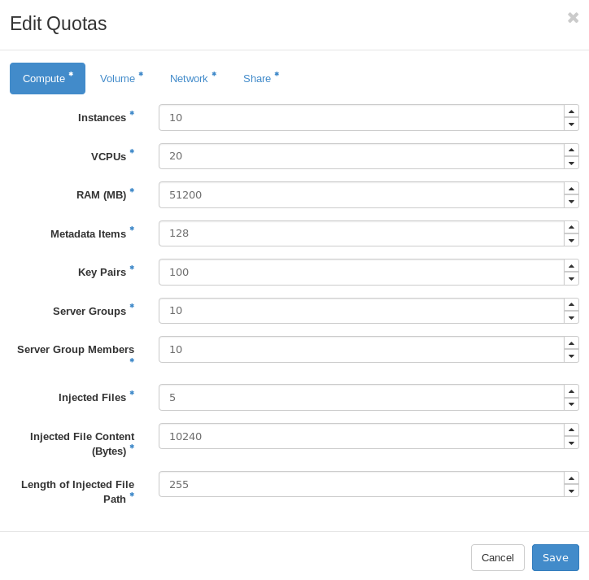
</kbd>

# OpenStack runbook 2

### User provisioning

#### 1. GUI

If you want to create a new user from the OpenStack Horizon Dashboard level as admin go to Identity -> Users.  
Make sure you are in the "admin" project.  
<kbd>
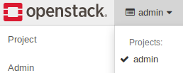
</kbd>

Press the "Create User" button to create a new user.  
<kbd>
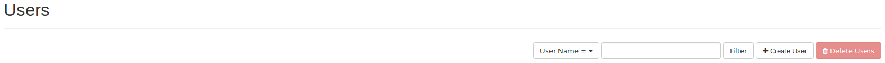
</kbd>

Fields marked with * are necessary  
<kbd>
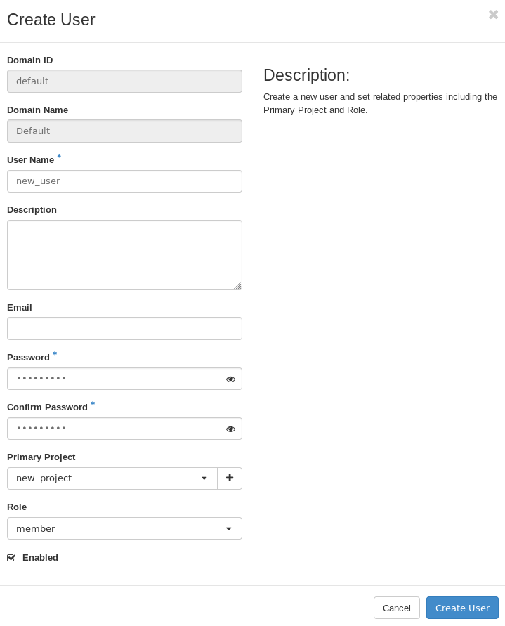
</kbd>

- User Name - name for the new user,
- Description - description for the new user,
- Email - email for the new user,
- Password - password for the new user,
- Primary Project - you can choose the primary project from the drop-down menu for the new user,
- Role - select "member" role.

After correctly completing the user creation process, the new user will be visible in the menu.  
<kbd>
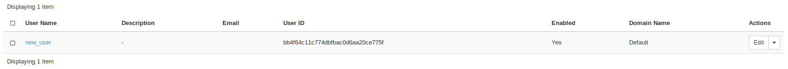
</kbd>

You can now log in to the newly created user.  
<kbd>
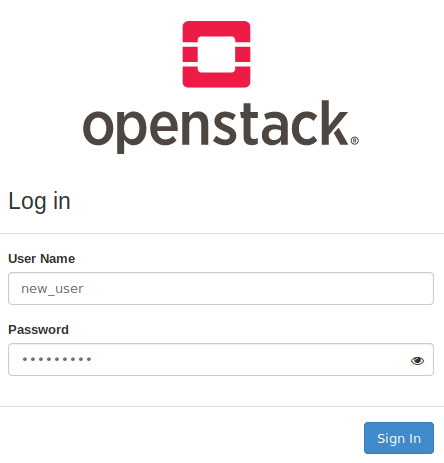
</kbd>

You can check which user you are logged in to in the top right corner of OpenStack Horizon Dashboard.  
<kbd>
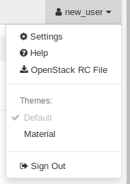
</kbd>

##### Adjusting role to the particular user

If you want to manage roles of the particular user go to Identity -> Projects. Search for the project you are interested in and select the "Manage Members".  
Make sure you are in the "admin" project.  
<kbd>
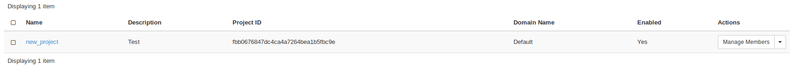
</kbd>

In the "Project Members" bookmark you can manage user roles in a specific project.  
<kbd>
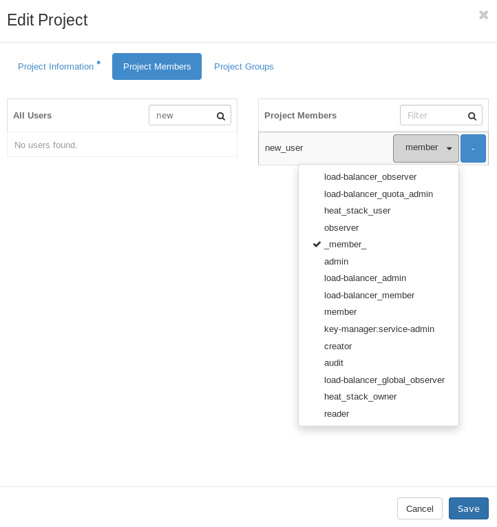
</kbd>

# OpenStack runbook 3

### Post-provisioning operations on the Support side in openstack

#### 1. GUI

Checking if the user has been provisioned properly:

##### Verifying a correctness signing on

Make sure the credentials created in OpenStack are the same as when configuring the new cloud.  
<kbd>
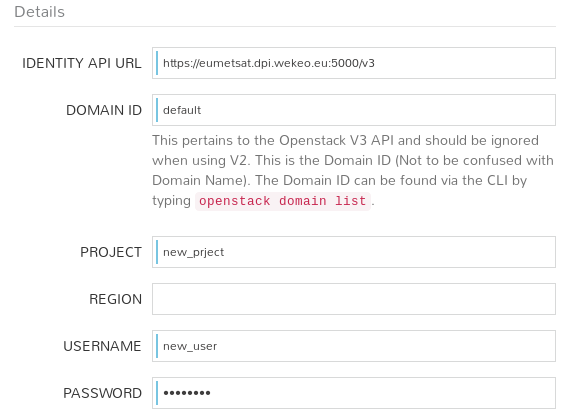
</kbd>

##### Verifying access to the cloud resources

on the example of instance creation:  
After configuring the new cloud, create a test instance from Morpheus level
<kbd>
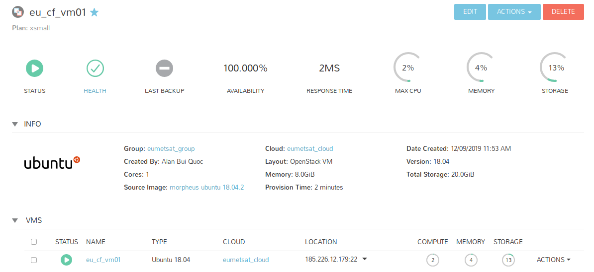
</kbd>

and check if it was created in Openstack.
<kbd>
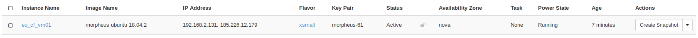
</kbd>

##### Verifying role adjustment

In the "Project Members" bookmark you can manage user roles in a specific project.  
<kbd>

</kbd>