# CloudFerro components runbook
### Document change control

 Version | Date | Pages | Processor | Changes| 
 --------|------|-------|-----------|---------
1E | 11.12.2019 | N/A | Markdown  |  Runbooks have been reindexed.<br> General awareness of the Morpheus structure in the context of its functionality in Morpheus - runbook 1<br> Morpheus operations - "be ready to aid" in Morpheus - runbook 6<br>Support awareness based on DeltaDesign concept in OpenStack - runbook 1


### [Morpheus](#morpheus-runbook-1)

##### 1. [General awareness of the Morpheus structure in the context of its functionality](#general-awareness-of-the-morpheus-structure-in-the-context-of-its-functionality)
   - basic management of various modules
      - Operations
      - Provisioning
      - Infrastructure
      - Administration


##### 2.  [Tenant provisioning (Master tenant level)](#tenant-creation-three-methods-explained)

   - Adjusting permissions by assigning a proper role
   - Adding users with different permissions
   - Verifying quota and t-shirt size restrictions


##### 3.  [User provisioning](#user-creation-three-methods-explained) 
  - User creation in a Tenant area
      - optionally checking in "password expired" mode
      - Adjusting role to the particular user
      - optionally providing basic cloud-init settings
   
   
##### 4.  [Cloud configuration](#cloud-configuration)
  - Verifying a correct DPI instance by a survey result
    - Enabling Instance discovering and and assigning OpenStack Identity


##### 5. [Post-provisioning operations on the Support side](#post-provisioning-operations-on-the-support-side-in-morpheus)
   - Checking if the user has been provisioned properly
      - verifying a correctness signing on
      - verifying access to the cloud resources
      - verifying access to the object storage
      - verifying role adjustment
      - verifying general permissions


##### 6. [Morpheus operations - "be ready to aid"](#morpheus-operations-be-ready-to-aid)
   - Provisioning instances
   - Uploading images
   - Configuring networks
   - Applying blueprints and workflows
   - Volume management
   - Object storage configurations
   - Group management


##### 7. Morpheus troubleshooting
  - Impersonating a specific use
  - IT Administration escalation - consider restarting the service

### [Openstack](#openstack-runbook-1)

##### 1.  [Support awareness based on DeltaDesign concept](#support-awareness-based-on-deltadesign-concept)
   - Clouds locations
   - Clouds user-specific use-cases
   - User destinations
   - Data available only to particular cloud instance


##### 2.  [Project provisioning (OpenStack admin account)](#project-provisioning)
   - Creating a project in default domain
   - Verifying quota size for particular projects


##### 3.  [User provisioning](#user-provisioning)
  - User creation in a domain-project area
      - configuring User passwords related to the Morpheus accounts
      - Adjusting role to the particular user 


##### 4.  [Post-provisioning operations on the Support side](#post-provisioning-operations-on-the-support-side-in-openstack)
   - Checking if the user has been provisioned properly
      - verifying access to the cloud resources
      - verifying access to the object storage
      - verifying role adjustment


##### 5. OpenStack troubleshooting
  - Impersonating a specific user
  - Re-production of the issues in separated development environment
  - Fixing discrepancies between Morpheus and OpenStack configuration panels
  - IT Administration escalation

# Morpheus runbook 1

### General awareness of the Morpheus structure in the context of its functionality

**Morpheus** is the main operational tool in the WekEO project. It contains several tabs that should interest both the consumer and the administrative side.

- Operations
- Provisioning
- Infrastructure
- Administration (mainly for Support and IT Administration staff)

The **Operations** tab contains several extensive and complex solutions to analyze your cloud operation. What's more, it allows you to visualize it all with the help of analytical charts and automatically generated reports.
Take interest to visit Reports.
<kbd>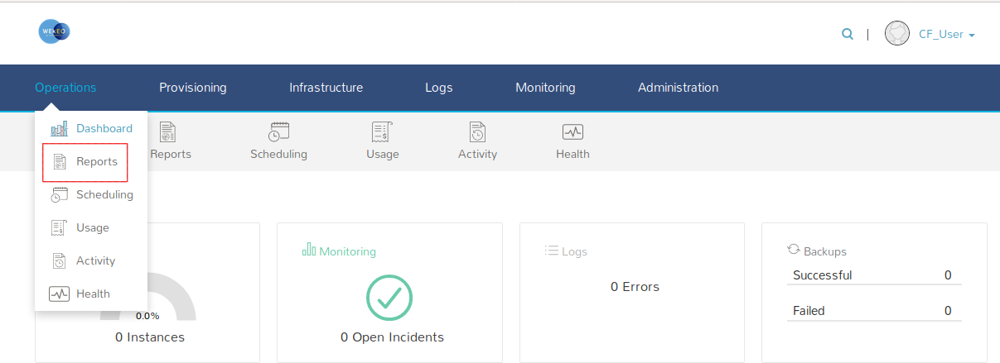</kbd>  

The **Provisioning** tab is responsible for storing information about instances, images and blueprints. There users are able to initialize new virtual machines, view their resources and manage them using a graphical interface.
Take interest to visit several labels:
- Instances
- Blueprints
- Virtual images

<kbd>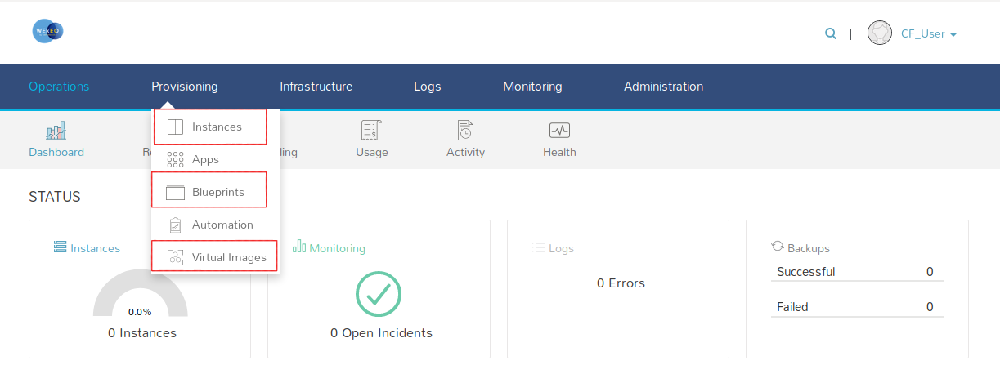</kbd>  

The **Infrastructure** tab is responsible for configuring cloud connections, grouping them, setting load balancing, and configuring the network. It also includes a full range of options for configuring storage: block storage, object storage and SFS (Manilla component).
Take interest to visit several labels:
- Clouds
- Network
- Load Balancers
- Storage
- Key & Certs  

<kbd>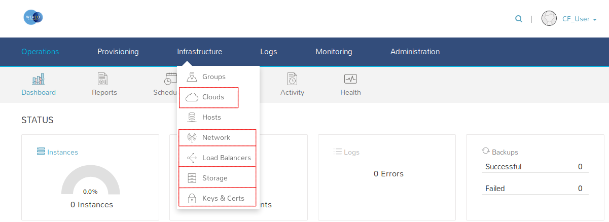</kbd>  

The **Administration** tab is visible to the customer, however, it is very limited in this case. The most important functionality for the customer is the ability to configure Cloud-init settings, i.e. user, password, and public key. Those settings are used for the provision of a virtual machine.
As an Administrator, we are capable of creating new tenants here, configuring roles, and assign T-Shirt sizes, which in Morpheus appear under the Plan & Pricing label.
As a customer take interest to Provisioning.
As an Administrator take interest to visit:
- Tenants
- Plans & Pricing
- Roles  

<kbd>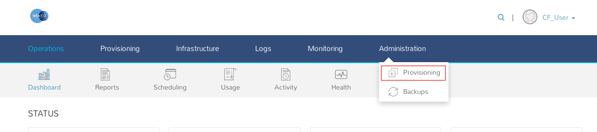</kbd>  
# Morpheus runbook 2

### User creation - three methods explained

#### 1. GUI

There have been used **impersonating** option in order to perform all operations in the tenant context.
Open your morpheus dashboard and navigate to the Administration tab on the right corner.
<kbd>

</kbd>

Choose option called **Users**.
<kbd>

</kbd>

Click on the blue button **+ CREATE USER**.
<kbd>

</kbd>

Take a look at the form to supply. In most cases you do not need to fill in every blank. Red color surrounded parameters are required in WEKEO use cases.
<kbd>

</kbd>

You can also configure additional parameters for distinct logging on Linux instances and Windows instances as well.
<kbd>

</kbd>

Below an example of filled in form. You can apply this configuration by clicking on **save changes**.
<kbd>

</kbd>

The new user has been added to your Tenant.
<kbd>

</kbd>

#### 2. API
You can use various programming languages and CURL also.
In this demonstration you can take a look at the code created in Ruby 2.6.5 using net/http module.


``` ruby
require 'net/http'
require 'uri'
require 'json'

=begin
Remember to export environment variables!
export MORPHEUS_API_URL="https://morpheus.wekeo-dev.cloudferro.com"
export MORPHEUS_API_TOKEN=$(morpheus access-token) gem morpheus-cli required
=end

#Morpheus Appliance URL combined with desired API method. 
#Attention ! /accounts/15/users points on the tenant with ID 15. You have to reassure yourself if you have chosen a correct ID.
url=URI.parse("#{ENV['MORPHEUS_API_URL']}/api/accounts/15/users")

#Headers for POST query
headers = {'Content-Type' => 'text/json',
           'Authorization' => "BEARER #{ENV['MORPHEUS_API_TOKEN']}"}

#Creating http object/requring ssl connection
http = Net::HTTP.new(url.host,url.port)
http.use_ssl=true

#Json data structure
data = {user:
    {
    username: "Wekeo-Test-API",
    email: "wekeo-test-api@cloudferro.com",
    firstName: "Wekeo",
    lastName: "Test",
    password: "aStrongpassword123!",
    role: {"id": 98}
    #id 98 points on our standard WekeoTenantUser
  }
}

#Creating post object
request = Net::HTTP::Post.new(url.request_uri, headers)

#Equipping our request in json data
request.body=data.to_json

#Sending http post request
response = http.request(request)

#Obtaining a response
puts response.body
```

Confirmation in Morpheus dashboard:
<kbd>

</kbd>

#### 3. CLI

You can take a look at --help flag for more advanced parameters.
``` bash
User@WEKEO:~/morpheus$ morpheus users add --firstName "Wekeo" --lastName "Test" --username "Wekeo-Test-CLI" \
--email "wekeo-test-cli@cloudferro.com" --password "Strongpass123!" --role "WekeoTenantUser" --account-id 15
Confirm Password: 
Max Storage (bytes) (optional): 
Max Memory (bytes) (optional): 
CPU Count (optional): 
Added user Wekeo-Test-CLI to account CF_mmakowski

User Details
==================

      ID: 58
 Account: CF_mmakowski
    Name: Wekeo Test
Username: Wekeo-Test-CLI
   Email: wekeo-test-cli@cloudferro.com
    Role: WekeoTenantUser
 Created: 11/14/19 10:10 AM
 Updated: 11/14/19 10:10 AM
```

# Morpheus runbook 3

### Tenant creation - three methods explained

#### 1. GUI

Sign in with your account in **master tenant**. Open your morpheus dashboard and navigate to the Administration tab on the right corner.
<kbd>
</kbd>

Choose option called **Tenants**.
<kbd>.</kbd>

Click on the blue button **+CREATE TENANT**.
<kbd>

</kbd>

Take a look at the form to supply. The most importants parameters are: Name, Subdomain and Role. |  Below you can examine a basic configuration.Set up a basic role for
:-------------------------:|:-------------------------:
<kbd></kbd>  |  <kbd></kbd>


Click on save changes and check if your tenant has been created properly.
<kbd>.</kbd>

If you click on **WekeoTestTenant-GUI** you will be redirected to the specific Tenant panel where you are able to create users.
<kbd>.</kbd>

#### 2. API

You can use various programming languages and CURL also.
In this demonstration you can take a look at the code created in Ruby 2.6.5 using net/http module.

```ruby
require 'net/http'
require 'uri'
require 'json'

=begin
Remember to export environment variables!
export MORPHEUS_API_URL="https://morpheus.wekeo-dev.cloudferro.com"
export MORPHEUS_API_TOKEN=$(morpheus access-token)
=end

#Morpheus Appliance URL combined with desired API method
url = URI.parse("#{ENV['MORPHEUS_API_URL']}/api/accounts")

#Headers for POST query
headers = {'Content-Type' => 'text/json',
           'Authorization' => "BEARER #{ENV['MORPHEUS_API_TOKEN']}"}

#Creating http object/requring ssl connection
http = Net::HTTP.new(url.host,url.port)
http.use_ssl = true

#Json data structure
data = {account:
    {
    name: "WekeoTestTenant-API",
    description: "My description",
    subdomain: "WekeoTestTenant-API",
    role: {"id": 24}
    #id 98 points on our standard WekeoTenant role
  }
}

#Creating post object
request = Net::HTTP::Post.new(url.request_uri, headers)

#Equipping our request in json data
request.body=data.to_json

#Sending http post request
response = http.request(request)

#Obtaining a response
puts response.body

```

#### 3. CLI

Adding WekeoTestTenant-CLI tenant:
``` bash
User@WEKEO:~/morpheus$ morpheus tenants add --name "WekeoTestTenant-CLI" --description "Test" --role "WekeoTenant" --currency "EUR"

Tenant WekeoTestTenant-CLI added

Tenant Details
==================

         ID: 44
       Name: WekeoTestTenant-CLI
Description: Test
  Subdomain: 
   Currency: EUR
    Created: 11/22/19 09:58 AM
    Updated: 11/22/19 09:58 AM
     Status: ACTIVE
```
Setting up a subdomain:
``` bash
User@WEKEO:~/morpheus$ morpheus tenants update {id} -O subdomain="subdomain_name"
```
Setting up a subdomain:for WekeoTestTenant-CLI:
```
User@WEKEO:~/morpheus$ morpheus tenants update 44 -O subdomain="WekeoTestTenant-CLI"

Tenant WekeoTestTenant-CLI updated

Tenant Details
==================

         ID: 44
       Name: WekeoTestTenant-CLI
Description: Test
  Subdomain: WekeoTestTenant-CLI
   Currency: EUR
    Created: 11/22/19 09:58 AM
    Updated: 11/22/19 09:59 AM
     Status: ACTIVE
```

# Morpheus runbook 4

### Cloud configuration

**1. GUI**

Sign in with your account in master tenant or impersonificate into TenantAdmin. Open your morpheus dashboard and navigate to the Infrastructure tab on the right corner.
<kbd>
</kbd>

Click on the **Clouds.**
<kbd>

</kbd>

Click on the blue button **+ADD** on your right side.
<kbd>

</kbd>

Search for openstack in search bar.  
<kbd>

</kbd>

Take a look at the blank form.
* **IDENTITY API URL** points on the Keystone API endpoint.
* **Domain ID** points on the default.
* **Project, Username** and **Password** are related to the setup configured in OpenStack.


<kbd>
</kbd>

Example configuration for the cloud:  
<kbd>
</kbd>

In **Advanced options** change Agent install mode to Cloud init / Unattend(when available)  
<kbd>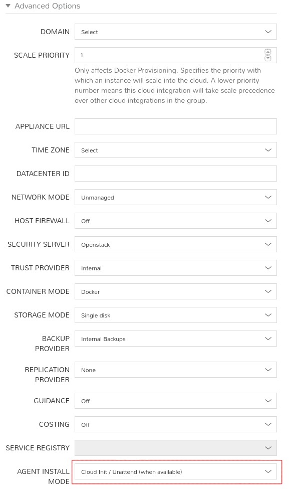
</kbd>

Associate existing group with your cloud or optionally create a new one.  
<kbd>
</kbd>

Newly created cloud configuration should start syncing. After that you should obtain an access to components such as security groups, networks etc. if they are currently present in the associated OpenStack project.
<kbd>
</kbd>

# Morpheus runbook 5

### Post-provisioning operations on the Support side in Morpheus

#### 1. GUI

Post-provisioning operations have been created in order to exclude potential issues related to the Tenant configuration.

##### Verify cloud configuration
Assure that your cloud configuration has been set up correctly.
<kbd>
</kbd>  

Check if the synchronized components are visible:  
e.g networks
<kbd>
</kbd>  

e.g security groups
<kbd>
</kbd>

##### Verify Object Storage Access

After configuring S3 bucket, check whether you are able to upload/download files.
<kbd>
</kbd>  

e.g upload of the image.png file
<kbd>
</kbd>  

You can verify visibility in OpenStack also.
<kbd>
</kbd>

##### Verify role adjustment

Check out if the roles in Identity source are mapped correctly in integration between Morpheus and WSO2.
<kbd>
</kbd>  

Verify roles for specific users:
<kbd>
</kbd>

##### Verify signing on as a user

Copy login URL for a particular tenant and try to log in using user created in wso2.

Grab URL in the Identity source configuration:  
<kbd>
</kbd>

Paste URL into the browser address bar and choose WSO2 login option.  
<kbd>
</kbd>

Admit the correctness for signing on.   
<kbd>
</kbd>

# Morpheus runbook 6

### Morpheus operations - "be ready to aid"

#### 1. GUI

##### Provisioning instances

Before creating the instance, make sure you have configured the user settings.

If you want to add a new instance, go to:  
Provisioning → Instances  
and press the "+ Add" button.  
<kbd>
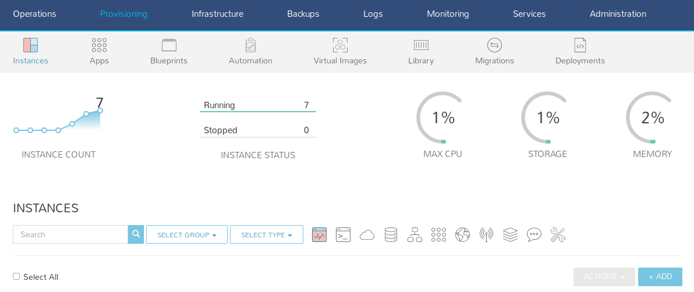
</kbd>

After pressing the button, the "Create instance" window should appear. In the "Type" section, select the type of image for your instance. By choosing "OpenStack" type in the next step you will be able to choose images from the selected OpenStack. Then press the "Next" button.  
<kbd>
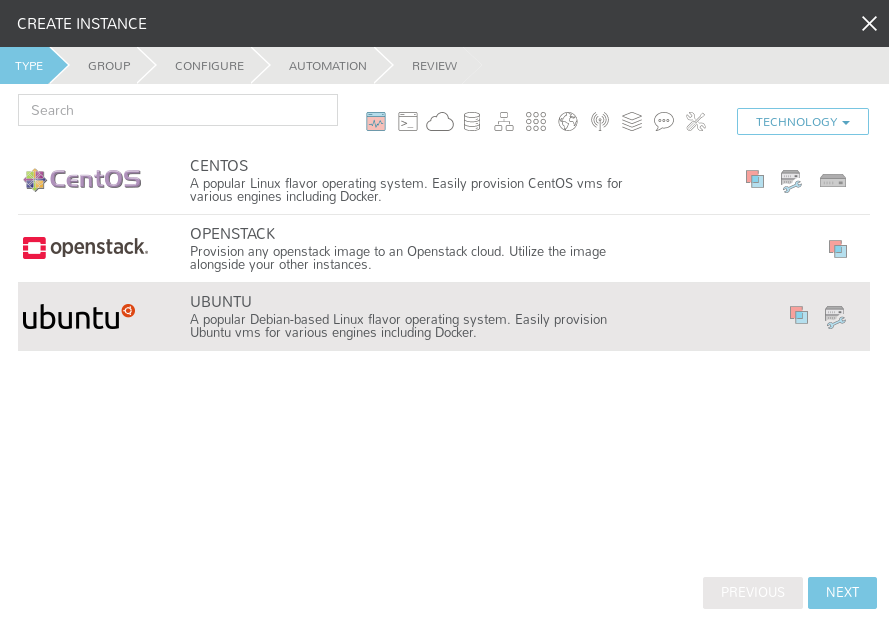
</kbd>

In the "Group" section select the group, cloud and enter the name of the new instance. Then press the "Next" button.  
<kbd>
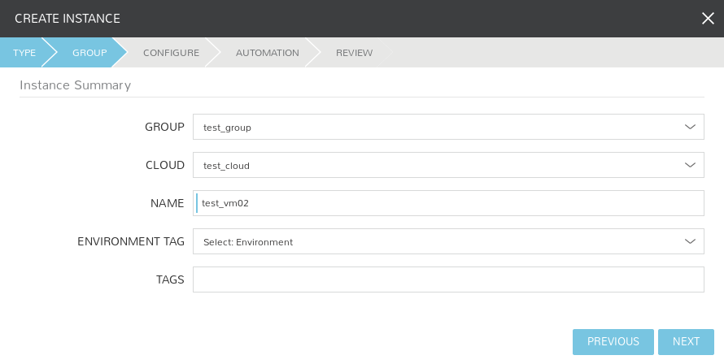
</kbd>

In the "Configure" section you can:

- Plan - choose a plan for your instance (e.g. xsmall),
- Volumes - select the "Local" option,
- Networks - select your network,
- Availability zone - select the "nova" option,
- Security group - for example: manually created security group "allow ssh" allows connection via ssh,
- Floating IP - select the "external" option.

By default, each local volume is of the SSD type.  

Then press the "Next" button.  
<kbd>
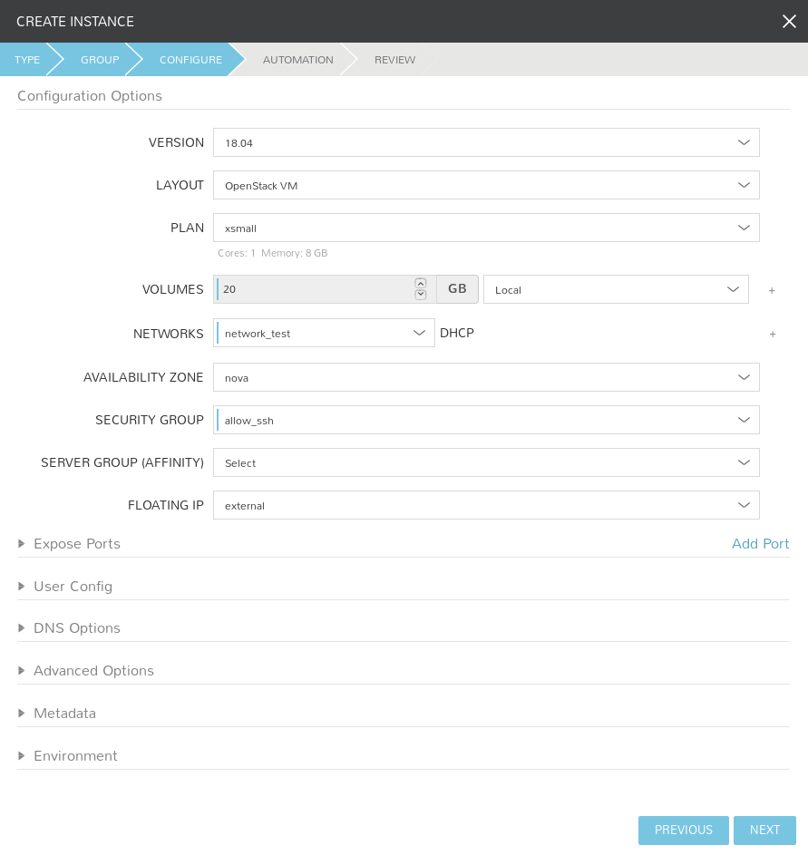
</kbd>

In the "Configure" section you can see a summary of the entire configuration. Finally press the "Complete" button.  
<kbd>
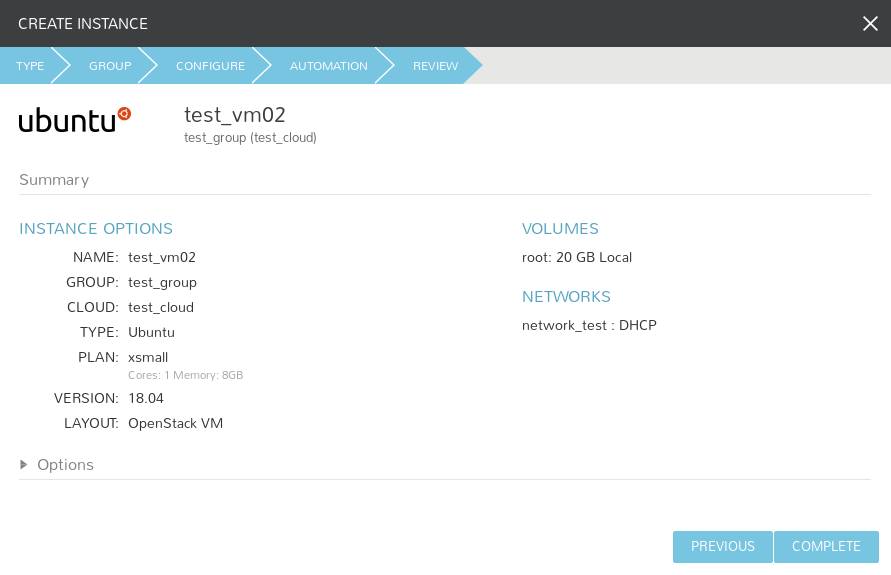
</kbd>

After the successful creation operation, the new instance should be visible in the instance menu.  
<kbd>
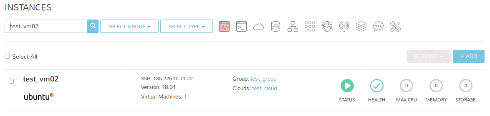
</kbd>

You can access the instance via the Morpheus console just go to:  
Provisioning → Instances  
select the "Consoles" tab in the instance menu.  
<kbd>
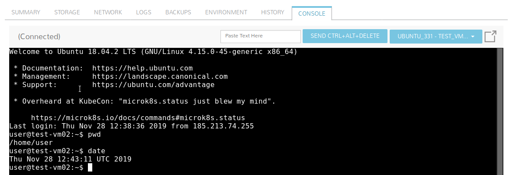
</kbd>

You can also access the instance via ssh using the command:  
```
ssh -i <private_key> <user>@<floating_ip>
```

<kbd>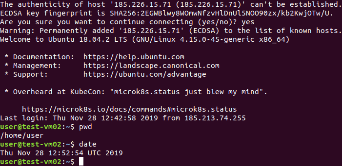
</kbd>

You can check the floating IP of your instances in the instance menu in the VMS section.  
<kbd>
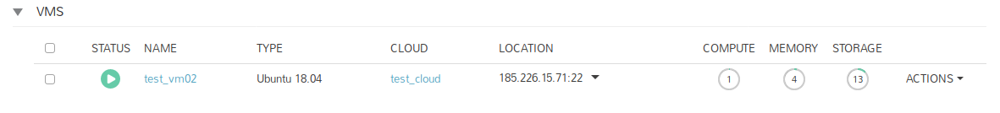
</kbd>

You can check the username in two places. Both configurations can occur simultaneously. When you create a new instance, two keys will be inserted.

In the upper right corner click on your username, then select the "User Settings" option (Linux/Windows Settings)  
<kbd>
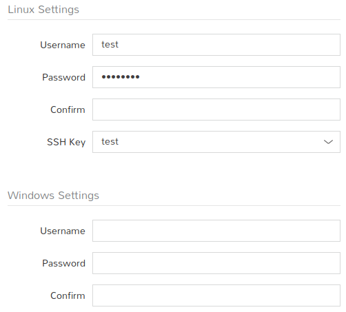
</kbd>

Administration → Provisioning/Cloud-Init Settings  
<kbd>
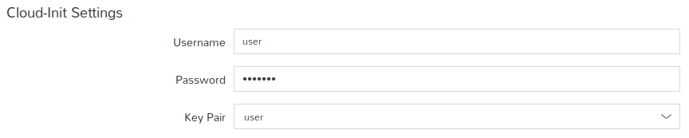
</kbd>

##### Uploading images

In order to upload a new image to your Morpheus repository please follow those steps.

Enroll Provisioning tab at the top of the application.
<kbd>
</kbd>

Choose the last option in the list → Virtual images.
<kbd>
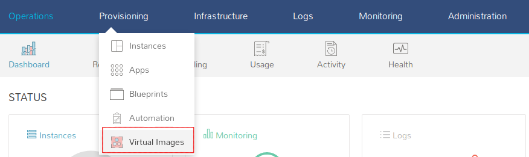</kbd>

Click on the blue button +ADD.
<kbd>
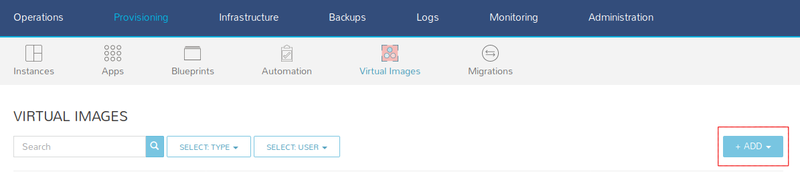</kbd>

Fill in the form with example data.
Take into consideration minimal requirements for deploying an instance (minimum RAM).
<kbd>
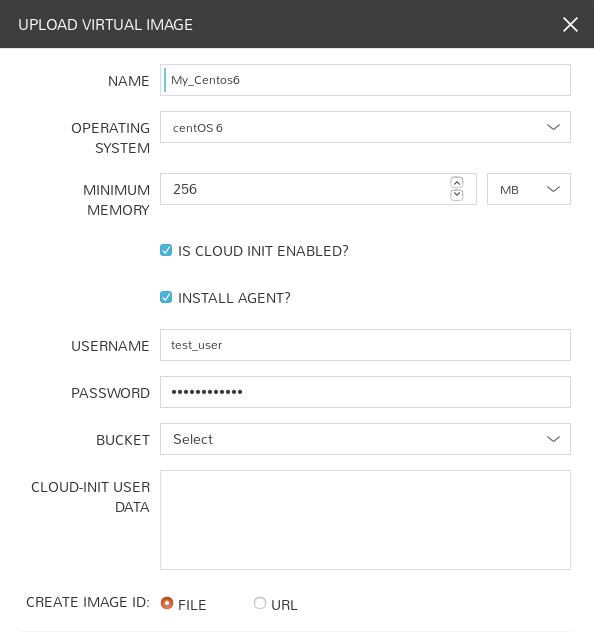</kbd>

Click on the ADD File button in order to choose your image file. Recommended and supported formats are respectively RAW and qcow2.
<kbd>
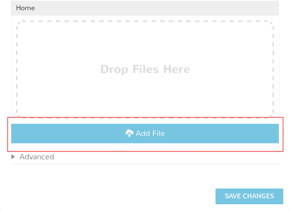</kbd>

Your image upload has been started. Please wait for a while.  
<kbd>
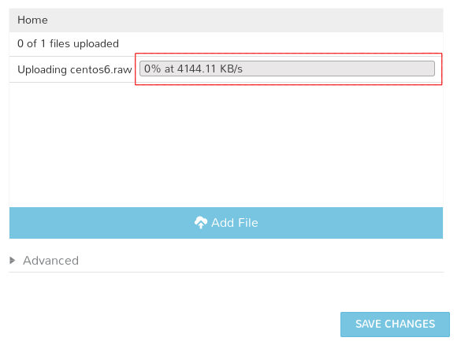</kbd>

The image file has been uploaded and now you can create image template by clicking on Save changes.  
<kbd>
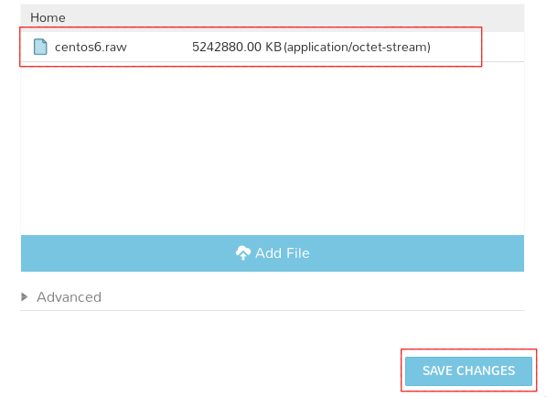</kbd>


Newly created template has been added to list of virtual images.  
<kbd>
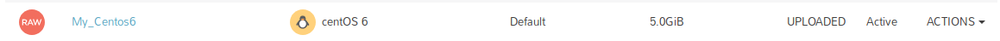</kbd>

##### Configuring networks

If you want to add a new network go to Infrastructure -> Network and click on the "+ Add" button and chose the "Neutron Router" option.  
<kbd>
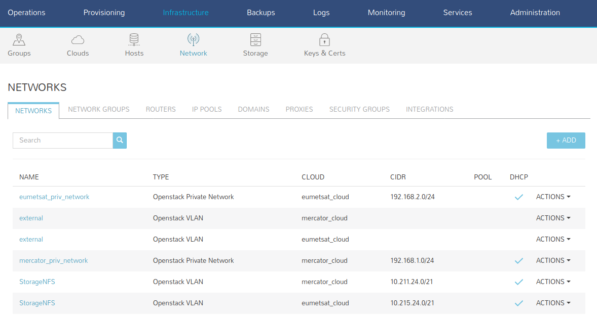
</kbd>

Complete the window as shown below:  
<kbd>
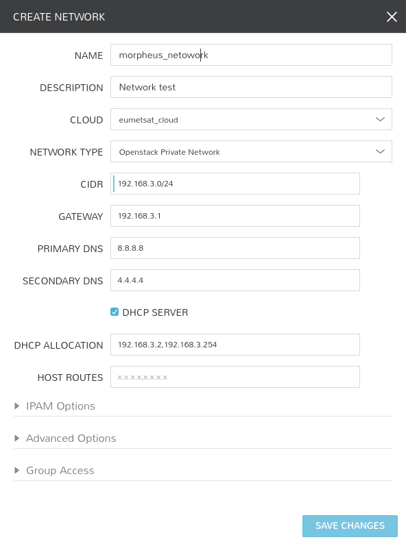
</kbd>

- Name - name for the new network,
- Description - discription for the new network,
- Cloud - chose your cloud,
- Network Type - select the "Openstack Private Network" option,
- CIDR - e.g 192.168.x.0/24
- Gateway - e.g 192.168.x.1
- Primary DNS - e.g 8.8.8.8
- Secondary DNS - e.g 4.4.4.4
- DHCP Server - enable
- DHCP Allocation - e.g 192.168.x.2,192.168.x.254

If you want to add a new router go to Infrastructure -> Network and switch on the "Routers" tab. To add a router click on the "+ Add" button.  
<kbd>
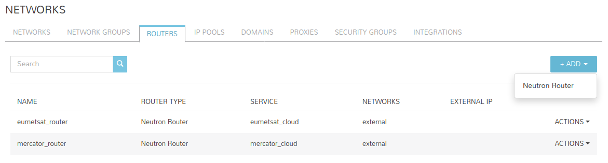
</kbd>

Complete the window as shown below:  
<kbd>
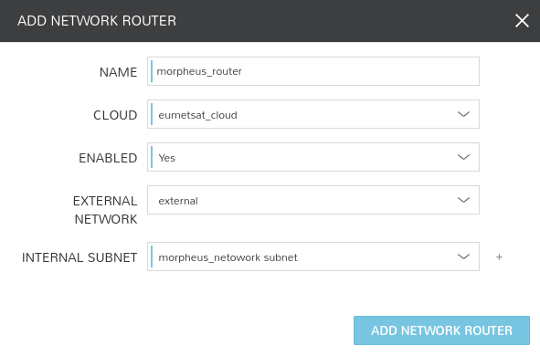
</kbd>

- Name - name for the new router,
- Cloud - chose your cloud,
- Enabled - select the "Yes" option,
- External Network - select the "external" option,
- Internal Subnet - chose subnet of your network.

##### Applying blueprints and workflows

If you want to add a customizable task for your upcoming workflows please go to Provisioning -> Automation.
Select Tasks tab and click on the blue button +ADD.
<kbd>
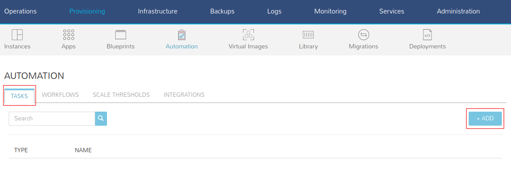
</kbd>

Please take a look at the form to fullfil. In **Type** enrolled list you can choose various automative deployment tools such as Ansible or raw bash script.
<kbd>
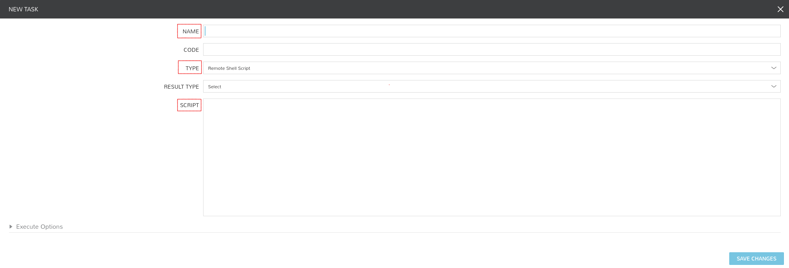
</kbd>

Beloy you can examine an example configuration. Apply your settings and click on the **SAVE CHANGES**.
<kbd>
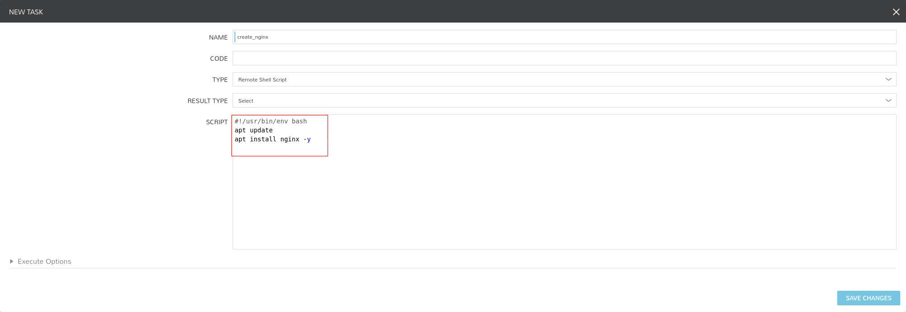
</kbd>

Change your tab view to workflows and click on the blue button +ADD.
<kbd>
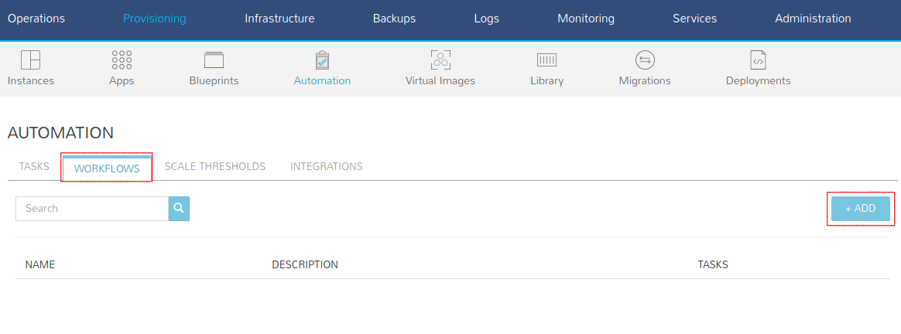
</kbd>

Please take a look at the form to fullfil. Within **Tasks** section you can apply a task for a specifc stage e.g post-provision.  
<kbd>
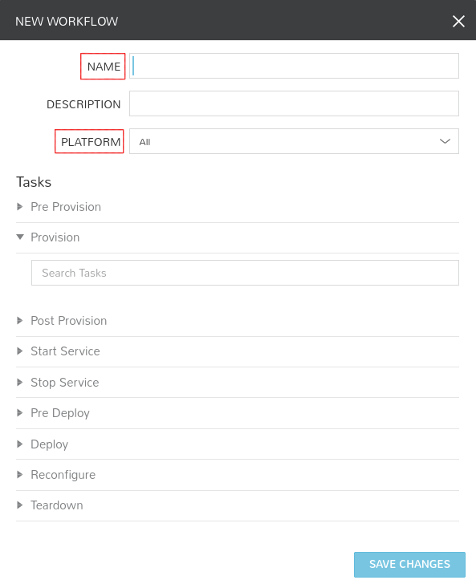
</kbd>

You might apply a previously created task.  
<kbd>
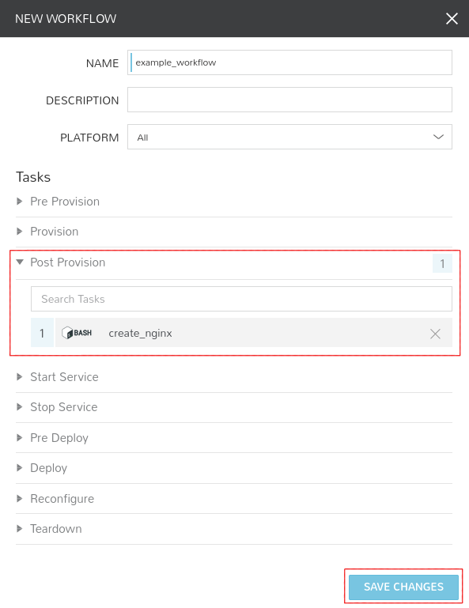
</kbd>

During instance initialisation reassure to select your **workflow**.  
<kbd>
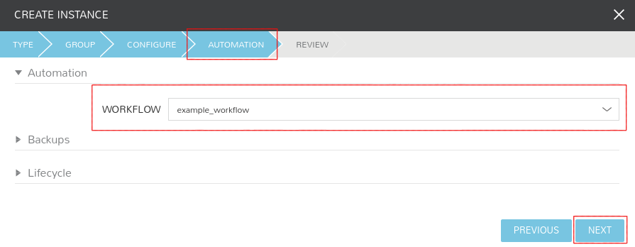
</kbd>

Establish SSH connection and check if the nginx server has been installed.
``` bash
CF_User@example_workflow:~$ whereis nginx
nginx: /usr/sbin/nginx /usr/lib/nginx /etc/nginx /usr/share/nginx /usr/share/man/man8/nginx.8.gz
```

##### Volume management

If you want to add a new volume, go to:  
Provisioning → Instances  
and select the instance you are interested in.  
<kbd>
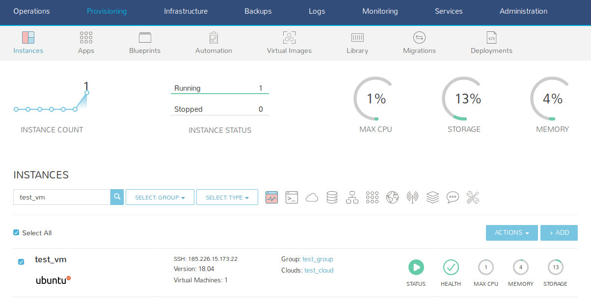
</kbd>

Then go to the "Action" drop-down menu in the upper right corner and select the "Reconfigure" option.  
<kbd>
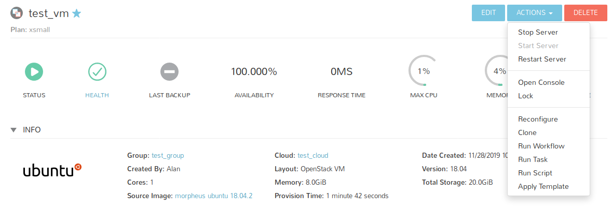
</kbd>

When the "Reconfigure Instance" window appears, press the "+" button next to the volume field. If you want to add more than one volume, just press the "+" button again.  
By default, all newly created volumes are of the HDD type. If you want to add an SSD volume, please contact with our Support Team. 
<kbd>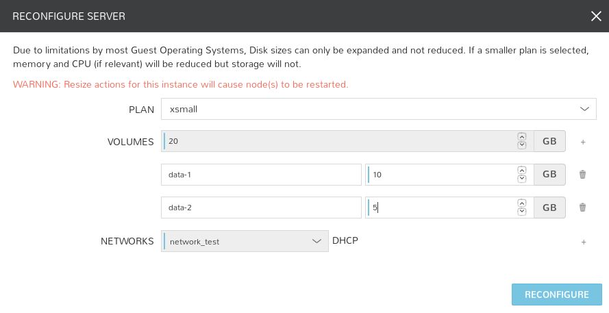
</kbd>

You can change the volume name in the new left field, and in the right you can change the volume size in gigabytes (GB). Click the "Reconfigure" button if you want to finish the reconfiguration process and create new volumes for the instance.

WARNING: Resize actions for this instance will cause node(s) to be restarted.

Newly created volumes should be attached to the instance automatically.  
<kbd>
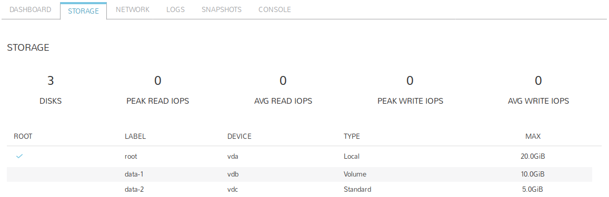
</kbd>  
You can see the newly added volumes in the "Storage" tab in the instance menu.

For further configuration You can connect to the instance via ssh.
```
ssh -i <private_key> <user>@<floating_ip>
```

<kbd>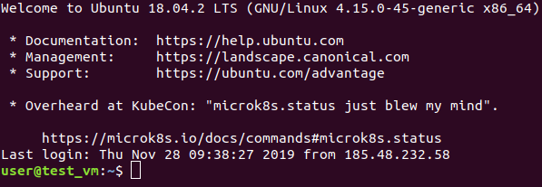
</kbd>

Execute the "lsblk" command:
```
lsblk -f
```
to check if new volumes have been attached to the instance.

<kbd>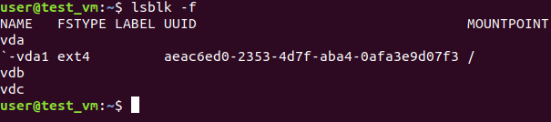
</kbd>

Run the command below to create a file system for the selected volume:
```
sudo mkfs.ext4 /dev/<disk>
```

\<disk\> - volume name, which you can check with the "lsblk" command, for example: vdb

<kbd>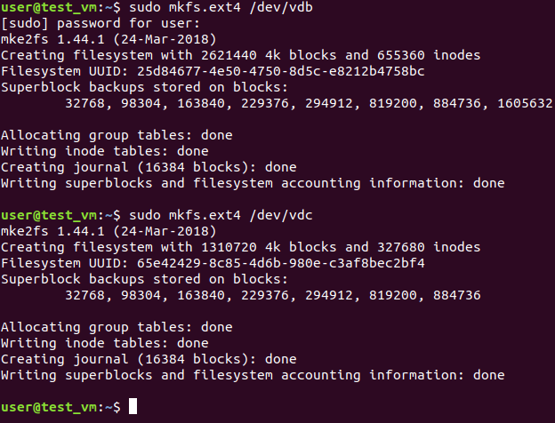
</kbd>

Then add the following line to the end of the /etc/ fstab file:
```
/dev/<disk> /<mount_dir> ext4 defaults 0 1
```

Thanks to that after restarting the instance the file system for individual volumes will be preserved.

<kbd>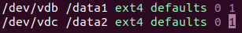
</kbd>

Then create a new directory under which the new volume will be mounted.
```
sudo mkdir /<mount_dir>
```

<kbd>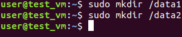
</kbd>

Finally mount the volume by command:
```
sudo mount /<mount_dir>
lsblk -f
```

<kbd>
</kbd>  
Use the lsblk command to check if the mount process has completed successfully.

#### Group management

If you want to configure a new group please go to Infrastructure -> Groups.  
In Groups panel click on the **+CREATE button**.  
<kbd>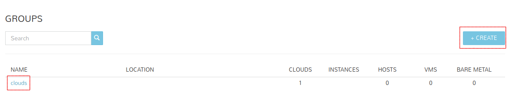
</kbd>

Name your group and click on **SAVE CHANGES**.  
<kbd>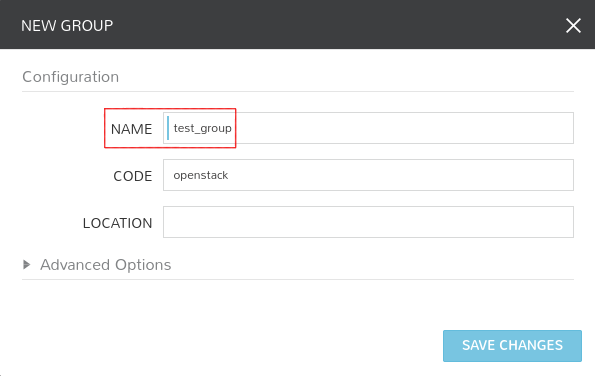
</kbd>  

To add an additional cloud you have to choose +ADD in the same row as OpenStack.  
<kbd>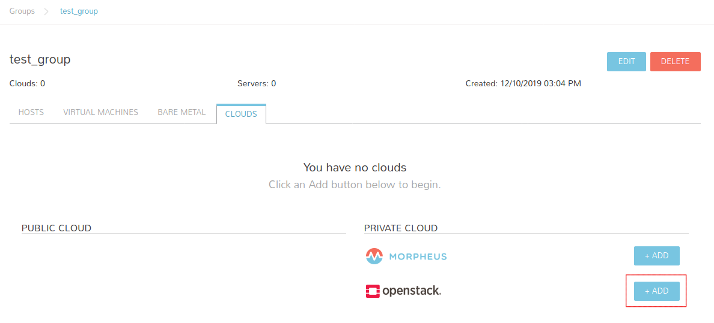
</kbd>  

Enroll a list to select a specific cloud.  
<kbd>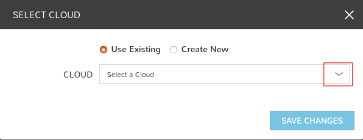
</kbd>

Apply by clicking on **SAVE CHANGES**.  
<kbd>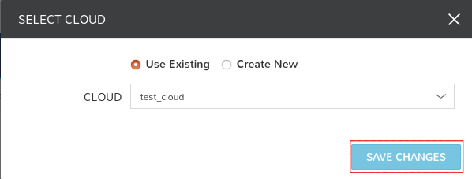
</kbd>

Your cloud has been added to the group.  
<kbd>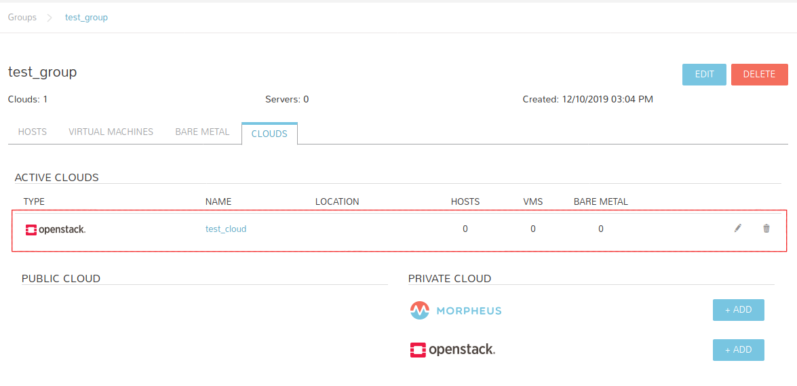
</kbd>
# OpenStack runbook 1

### Support awareness based on DeltaDesign concept

#### Clouds locations

Available DPI's in the WEkEO project:

- ECMWF
- EUMETSAT
- Mercator
- Elasticity

#### Clouds user-specific use-cases

In the WEkEO project, users will be able to process satellite data, analyze it, and download into their virtual machines, all due to access to the data repository. According to the project assumptions, in each DPI you will find dedicated satellites/instruments compatible with their various specific use-cases.

#### User destinations

Tenant location in DPI is allocated based on a short survey regarding expected data interest.

#### Data available only to particular cloud instance

# OpenStack runbook 2

### Project provisioning

#### 1. GUI

If you want to create a new project from the OpenStack Horizon Dashboard level as admin go to Identity -> Projects.  
Make sure you are in the "admin" project.  
<kbd>

</kbd>

Press the "Create Project" button to create a new project.  
<kbd>

</kbd>

Add a name for the new project (e.g. new_project).  
<kbd>

</kbd>

In the "Project Members" tab you can add users who will have access to the project.  
<kbd>

</kbd>  

To create a new project, press the "Create Project" button.
After correctly completing the project creation process, the new project will be visible in the menu.  
<kbd>

</kbd>  

You can move between different projects through the drop-down menu in the upper left corner of OpenStack Horizon Dashboard.  
<kbd>

</kbd>

##### Verifying quota size

If you want to view project limit summary go to Project -> Compute -> Overview.  
The pie diagrams display limits for specific components.  
<kbd>

</kbd>

If you want to change quta size go to Identity -> Projects. Search for the project you are interested in and select the "Modify Quotas" option from the drop-down menu.  
Make sure you are in the "admin" project.  
<kbd>

</kbd>

You can change the size of the quotas from the "Edit Quotas" window. Click on the "Save" button to save your changes.  
<kbd>

</kbd>

# OpenStack runbook 3

### User provisioning

#### 1. GUI

If you want to create a new user from the OpenStack Horizon Dashboard level as admin go to Identity -> Users.  
Make sure you are in the "admin" project.  
<kbd>

</kbd>

Press the "Create User" button to create a new user.  
<kbd>

</kbd>

Fields marked with * are necessary  
<kbd>

</kbd>

- User Name - name for the new user,
- Description - description for the new user,
- Email - email for the new user,
- Password - password for the new user,
- Primary Project - you can choose the primary project from the drop-down menu for the new user,
- Role - select "member" role.

After correctly completing the user creation process, the new user will be visible in the menu.  
<kbd>

</kbd>

You can now log in to the newly created user.  
<kbd>

</kbd>

You can check which user you are logged in to in the top right corner of OpenStack Horizon Dashboard.  
<kbd>

</kbd>

##### Adjusting role to the particular user

If you want to manage roles of the particular user go to Identity -> Projects. Search for the project you are interested in and select the "Manage Members".  
Make sure you are in the "admin" project.  
<kbd>

</kbd>

In the "Project Members" bookmark you can manage user roles in a specific project.  
<kbd>

</kbd>

# OpenStack runbook 4

### Post-provisioning operations on the Support side in openstack

#### 1. GUI

Checking if the user has been provisioned properly:

##### Verifying a correctness signing on

Make sure the credentials created in OpenStack are the same as when configuring the new cloud.  
<kbd>

</kbd>

##### Verifying access to the cloud resources

on the example of instance creation:  
After configuring the new cloud, create a test instance from Morpheus level
<kbd>

</kbd>

and check if it was created in Openstack.
<kbd>

</kbd>

##### Verifying role adjustment

In the "Project Members" bookmark you can manage user roles in a specific project.  
<kbd>

</kbd>
